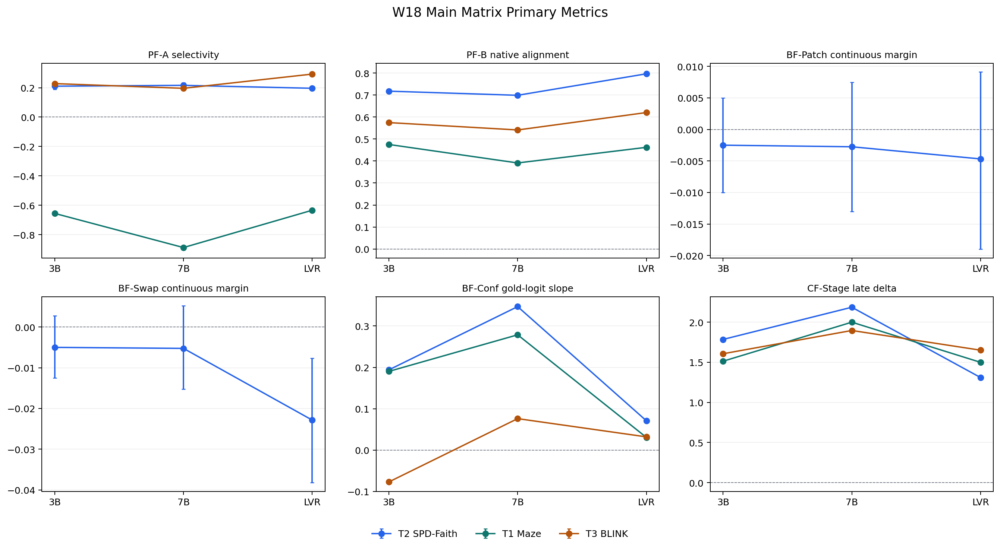
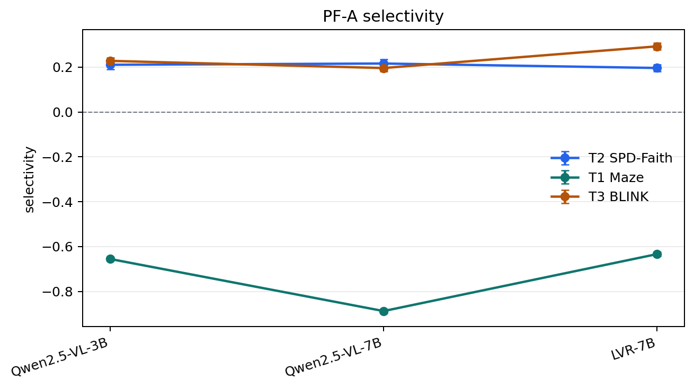
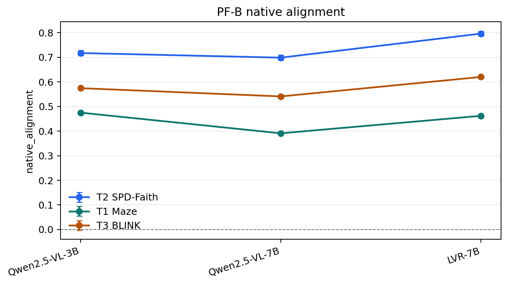
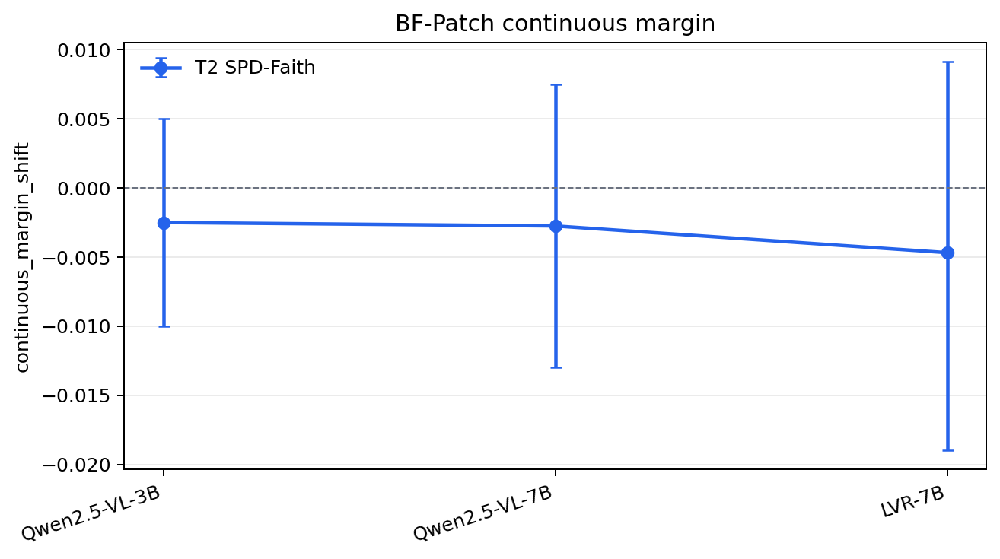
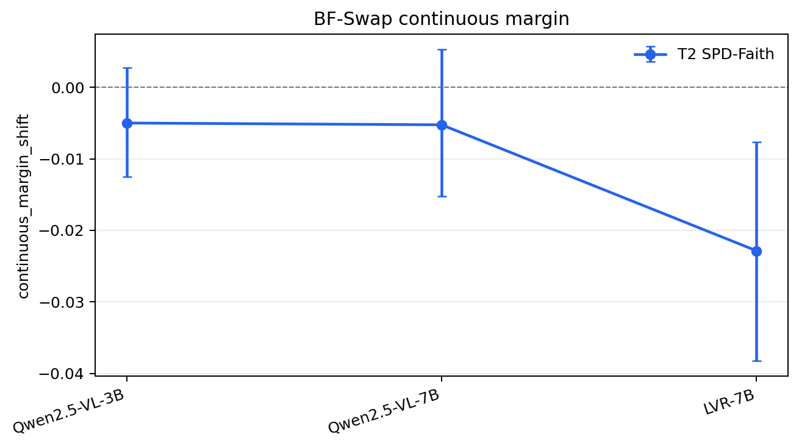
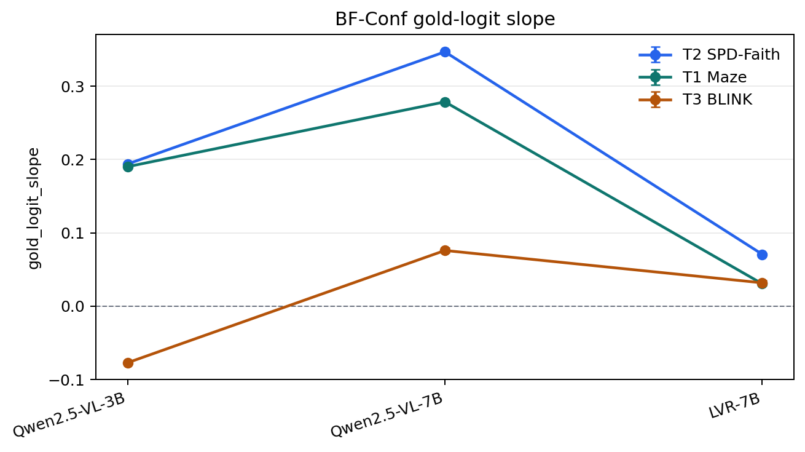
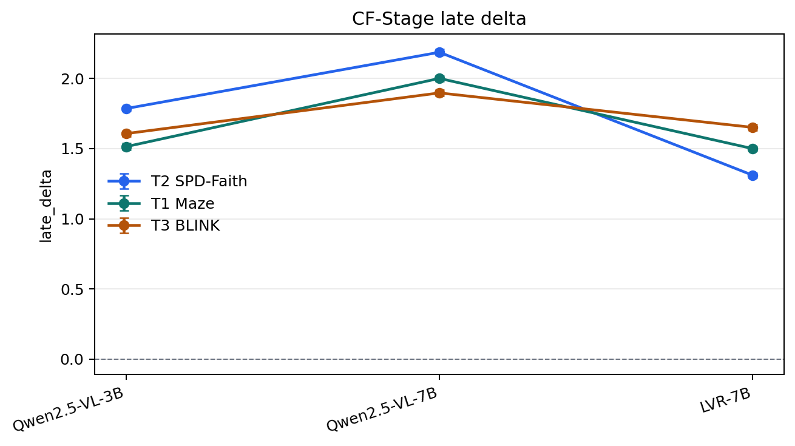
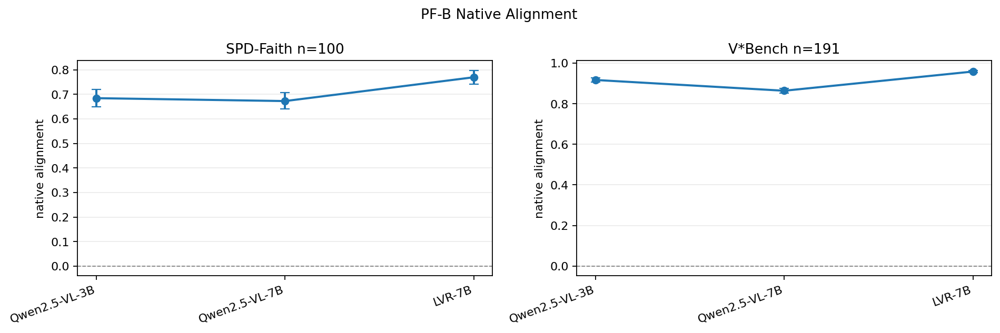
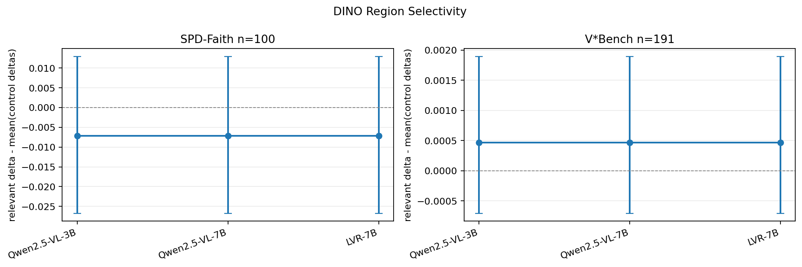

# Latent Visual Faithfulness Is Not Latent Visual Use

Date: 2026-05-27

This note is a self-contained, Main-paper-oriented brief of the current evidence in the repository. It is written as a compact manuscript skeleton rather than as an internal run log. The evidence now supports a reproducible causal audit toolkit, true LVR hidden-feedback intervention gates, a Monet Transformers latent-mode range gate, a full local T1/T2/T3 main matrix where staged data permits, a completed W20 V*Bench/VStar high-resolution bbox spotlight, and a completed T4 VSI visual-accuracy sanity artifact from the official HF video zips. T4/VSI visual data is no longer blocked: `scannetpp.zip` from `nyu-visionx/VSI-Bench` has been converted into 50 frame-grid JPEGs and 1458 usable QA rows, and the 32-frame three-model `output_accuracy_sanity` run is merged and validated at `runs/main_vsi_accuracy_scannetpp_32f_paper/merged`. It should still not be described as a causal Main-paper matrix: Monet modified-vLLM scheduler-native tracing is deferred, T4/VSI is output accuracy only, BLINK PF rows are weak-oracle center-fallback diagnostics, V*Bench is a small-n spotlight rather than a Main matrix task, and the regression summary is a fixed-effect fallback rather than a full sample-level mixed-effects model.

## Introduction

Multimodal large language models increasingly solve visual tasks by moving some reasoning into hidden or continuous representations rather than exposing every intermediate step as text. In latent visual reasoning (LVR), a model may create latent visual tokens or hidden feedback states that are meant to store task-relevant evidence, such as which image region changed, which object matters, or how a path through a maze should proceed. This design is attractive because it can reduce visible chain-of-thought cost and may let the model reason in a more visual internal space.

Performance alone does not tell us whether these latent states are faithful. A model can answer correctly while ignoring the latent state, or it can encode visual evidence in a latent state but fail to use that evidence when choosing the final answer. The central question of this project is therefore not just "does the model get the answer right?", but:

> When visual reasoning is moved into hidden latent states, can we separately measure whether the state encodes visual evidence, whether it causally drives the answer, and whether its effect survives through the reasoning chain?

We organize the audit into three axes. The first is **availability**: can task-relevant visual evidence be detected in the representation? The second is **usage**: does changing or replacing the state change the answer in the expected direction? The third is **retention**: does the visual contribution persist across early, middle, and late stages, or does it decay before the final answer?

The repository implements a six-metric primary audit suite around these axes, supports Qwen2.5-VL baselines, LVR-7B, and Monet-7B, and has run evidence across SPD-Faith, MazePlanning, and BLINK. The current strongest LVR-specific result is the trace-latent package: all six primary metrics run on real LVR generation-time hidden-feedback states at `n=500` on SPD-Faith, and the lighter PF-A/PF-B/BF-Conf/CF-Stage subset runs at `n=1000`. The current strongest cross-model result is the W18 full local matrix: SPD-Faith and BLINK at `n=1000`, Maze at its full local/upstream `n=500`, across Qwen2.5-VL-3B, Qwen2.5-VL-7B, and LVR-7B.

## Terminology For LLM Reasoning Readers

This project uses language from mechanistic interpretability, multimodal evaluation, and latent-reasoning papers. The key terms are:

| Term | Meaning in this paper |
|---|---|
| Latent visual reasoning | A model performs part of visual reasoning in hidden vectors or special latent tokens rather than only in visible text tokens. |
| Latent state / hidden-feedback state | The internal vector that is fed back into the model during LVR generation. For LVR-7B trace runs, this is captured as `output_last_position_hidden_state`. |
| Query-span audit | A control-style audit that reads or intervenes on hidden states aligned with prompt/query positions. It is useful for comparing Qwen and LVR under a common interface, but it is not the same as intervening on LVR's live generation loop. |
| Trace-latent audit | An audit that instruments the actual generation-time LVR loop and reads or patches the hidden-feedback states produced during generation. This is the stronger evidence layer for LVR. |
| Counterfactual pair | A pair of visually related samples, usually clean versus modified, where the correct answer should flip in a known direction. SPD-Faith provides this structure. |
| Patch | Replace one hidden state in a target run with a hidden state captured from a source/counterfactual run, then test whether the output moves toward the source answer. |
| Swap | A controlled replacement test that includes self, reverse, and random-pair controls to detect whether an intervention effect is specific or generic. |
| Logit/logprob margin | A continuous score comparing the model's preference for two candidate answers. Positive or negative values are less important by themselves than whether an intervention shifts the margin in the predicted direction. |
| Weak-oracle center fallback | A fallback used when a dataset lacks bounding boxes. The code treats the center region as a coarse proxy for "relevant visual region"; this is diagnostic, not strong localization evidence. |
| V*Bench / VStar | A high-resolution detail-localization benchmark with per-image JSON bbox annotations. The HF Data Studio/parquet projection hides these bboxes, so the repo uses a full `huggingface_hub.snapshot_download` path. |
| Bbox area ratio | The fraction of image pixels covered by the annotated answer box. In W20 V*Bench, the median ratio is about `0.00077`, so most target regions occupy less than one tenth of one percent of the image. |
| Image budget | The maximum image side/pixel count used for a metric run. W20 V*Bench keeps PF-A/PF-B at 1024px for localization, while BF-Conf uses a 512px auxiliary budget to avoid high-resolution OOM. |
| Native alignment | A PF-B alignment readout based on the model's own visual/hidden representations. This is the model-facing PF-B scalar. |
| DINO region selectivity | An optional PF-B sensitivity check from an external DINOv2 image backbone. It compares how much DINO embeddings change under relevant-region masks versus irrelevant/random masks. Because it depends on images and masks rather than the tested model's hidden states, it is a sensitivity check, not a replacement for native alignment. |
| 95% bootstrap CI | A nonparametric uncertainty interval computed by resampling sample-level reductions. If intervals are narrow, the estimate is stable under resampling; it does not by itself prove causal validity. |

The three audit axes can be read like this. **Availability** asks whether visual information is present in the representation. **Usage** asks whether changing that representation changes the answer. **Retention** asks whether the effect survives from early to late reasoning stages. A model can score well on availability but poorly on usage; this is the main conceptual reason for separating the axes.

When reading the tables, the sign and scale of a metric should be interpreted metric-by-metric rather than as a universal "higher is always better" score. PF-A and PF-B are availability readouts, so positive selectivity or higher native alignment usually means the representation is more sensitive to the intended visual evidence. BF-Patch and BF-Swap are usage readouts, so the important question is whether the candidate-answer margin moves in the predicted direction and whether the confidence interval excludes zero. BF-Conf and CF-Stage are trajectory readouts; large values can reflect strong confidence or late-stage sensitivity, but they do not automatically prove that a latent state is faithful. This is why the report keeps availability, usage, and retention separated instead of averaging them into one leaderboard.

## Related Work

**Latent visual reasoning methods.** Recent MLLM work explores different ways to represent intermediate visual reasoning in latent space. Mirage introduced helper-image-derived latent visual tokens. LVR generates latent representations focused on bounding-box regions. Latent Sketchpad adds a vision-head mechanism and a sketch decoder, and its MazePlanning data is useful for stage-like reasoning audits. Monet emits visual latent tokens through an official modified-vLLM runtime and exposes a Transformers latent-mode path. CoVT, CrystaL, LaCoT, ILVR, LIVR, and related methods broaden the design space with interleaved visual tokens, self-supervision, variational latent reasoning, or selective perceptual modeling. This project treats these systems as audit targets rather than proposing another latent-reasoning model.

**Faithfulness and diagnostic work.** Prior work already shows that latent visual reasoning can fail to use its own latents. CapImagine reports input-to-latent and latent-to-answer disconnects. "What is Holding Back LVR?" shows that replacing latent tokens with uninformative tokens can leave accuracy largely unchanged. "Visual Latents Know More Than They Say" frames a related suppression problem: latents may contain useful visual information that is not expressed in the answer. These papers make the broad claim "latents may not be used" less novel. Our intended differentiation is a unified causal audit protocol that separates availability, usage, and retention across models, tasks, and intervention sites.

**Benchmarks and external anchors.** SPD-Faith is a paired spot-the-difference benchmark designed to diagnose multimodal chain-of-thought faithfulness; it is especially useful for counterfactual answer-transfer tests because each sample has clean and modified visual facts. MazePlanning provides visual planning samples with natural stage structure, making it useful for retention and stage-decay tests. BLINK provides fine-grained perception cases and is the current T3 mainline perception task. VSI-Bench remains output accuracy sanity only, not causal evidence; the current local T4 staging uses official `nyu-visionx/VSI-Bench` annotations plus the official `scannetpp.zip` videos converted into static frame-grid JPEGs. V*Bench/VStar is staged from the full HF repository snapshot rather than the Data Studio/parquet projection, so the per-image JSON bbox annotations are available and W20 completed a real `n=191` high-resolution localization spotlight.

## Methodology

### Models And Evidence Levels

The current model pool has three main audit models plus one second-paradigm range gate.

| Model | Role | Current evidence level |
|---|---|---|
| Qwen2.5-VL-3B | no-latent small baseline | query-span / hidden-state control in SPD, Maze, BLINK matrices |
| Qwen2.5-VL-7B | no-latent baseline | query-span / hidden-state control in SPD, Maze, BLINK matrices |
| LVR-7B | explicit latent visual reasoning model | true hidden-feedback patch gates, trace-latent metrics, and W18 matrix rows |
| Monet-7B | second latent paradigm | Transformers latent-mode causal range gate only; modified-vLLM generation trace deferred |

The key distinction is **query-span audit versus trace-latent audit**. Query-span metrics inspect prompt-side or teacher-forced spans and are useful for cross-model regression matrices, but they are not the same as intervening on a model's real hidden-feedback generation loop. The W14-W17 trace-latent path instruments LVR generation and captures `output_last_position_hidden_state` tensors during LVR mode. Qwen rows are therefore query-span / hidden-state controls by design. LVR rows can be real generation-trace latent evidence when `trace_latent.enabled=true`. Monet is currently a Transformers latent-mode real-latent range gate rather than a scheduler-native generation trace.

### Tasks

| Task | Purpose | Current evidence |
|---|---|---|
| T1 MazePlanning | step-like visual planning and retention | W18 full local run at `n=500`; upstream/local data-limited below 800 |
| T2 SPD-Faith | paired visual counterfactuals and answer transfer | W18 `n=1000`; paired BF subset `n=500`; LVR trace-latent gates at `n=500` and `n=1000 light` |
| T3 BLINK | fine-grained perception generalization | W18 `n=1000`; all rows weak-oracle because local records lack bbox metadata |
| T4 VSI-Bench `scannetpp` visual subset | output accuracy sanity only | official HF 32-frame static-grid run complete: 1000 samples/model, zero errors, merged sanity pass |
| Spotlight V*Bench/VStar | high-resolution detail localization | W20 completed full `n=191` from HF snapshot JSON bboxes; small-n spotlight, not Main matrix |

### Metrics

The six primary metrics are designed to avoid treating one proxy as the whole story.

| Metric | Axis | Plain-language definition |
|---|---|---|
| PF-A corruption selectivity | availability | Compare latent change after masking relevant, irrelevant, and random visual regions. |
| PF-B patch alignment | availability | Measure alignment between hidden/latent representations and native visual-region signals. The Main scalar is native alignment; W21 adds DINO as an external sensitivity/null check. |
| BF-Patch answer transfer | usage | Patch a counterfactual source state into a target run and test whether the answer or margin moves toward the source answer. |
| BF-Swap latent replacement | usage | Replace latent state with controlled alternatives and measure answer or margin shifts. |
| BF-Conf calibrated progression | usage | Track whether the gold-answer logit margin changes across layers or trace states. |
| CF-Stage decay | retention | Compare early, middle, and late readouts under perturbation to estimate whether visual influence is retained. |

The paper-facing BF continuous scalar is now `continuous_margin_shift`. In standard/query-span BF runs, this is the forced candidate-sequence logprob margin shift. In trace-latent BF runs, it uses aligned generation scores when available or latent logit-lens margins when generation-score alignment is unavailable, and excludes parsed-answer fallback from the primary continuous mean. Legacy `logprob_margin_shift` and `swap_margin_shift` remain compatibility fields for older artifacts.

## Experiments

### True LVR Hidden-Feedback Gates

The earliest causal LVR gates operated on constrained SPD-Faith answers and patched LVR hidden-feedback states during generation.

| Gate | n | Main result |
|---|---:|---|
| W3 last-step patch | 50 | latent answer transfer rate 0.52 |
| W4 step sweep | 50 | best step 4, best transfer 0.44, step AUC 0.424 |
| W5 capacity sweep | 50 each | best transfer roughly 0.44 to 0.52 across tested capacities; no monotonic scaling claim |
| W6 best-step replication | 50 | step 4 transfer 0.60 |

These are real LVR hidden-feedback intervention gates, but they are small-n and mostly SPD-Faith constrained-answer experiments.

### Monet Latent Gate

W13 adds a second-paradigm causal range gate for Monet-7B. It uses Monet's official Transformers `latent_mode` path: capture source `ce_patch_vec` tensors and inject them at target `ce_patch_pos` positions, then score constrained `original` versus `modified` answers.

| Metric | n | Mean | 95% CI |
|---|---:|---:|---:|
| latent_answer_transfer_rate | 50 | 0.06 | [0.00, 0.14] |
| latent_margin_shift | 50 | -0.027500 | [-0.060000, 0.005000] |

This proves that the repository can run a second latent-paradigm hidden-state patch. It does not yet audit Monet's official modified-vLLM scheduler-native generation trace.

### W18 Full Local Main Matrix

W18 completed the local T1/T2/T3 matrix across Qwen2.5-VL-3B, Qwen2.5-VL-7B, and LVR-7B. The validated artifact root is `runs/w18_main_matrix_full_local/merged`; the committed report with tables and figures is `docs/validation_report_w18_full_local_matrix.md`.

| Dataset | Usable local n | W18 status | Boundary |
|---|---:|---|---|
| T2 SPD-Faith | 2996 | `n=1000` run; BF paired subset `n=500` | paired bbox/region oracle |
| T1 Maze | 500 | full local set `n=500`; data-limited below 800 | no paired BF metrics |
| T3 BLINK | 1000 | `n=1000`; `weak_oracle=1000` | center fallback, no strong bbox claim |
| V*Bench/VStar | 191 | not part of W18; W20 spotlight completed afterward | full HF snapshot required because parquet/Data Studio hides bbox JSON |
| T4 VSI-Bench `scannetpp` visual subset | 1458 staged, config runs 1000 | official `nyu-visionx/VSI-Bench` `scannetpp.zip` converted into 50 32-frame grid JPEGs; three-model merge and sanity validation complete | output accuracy sanity only; no causal metric claim |

Main matrix validators passed:

```text
validate_main_matrix.py: MAIN MATRIX VALIDATION PASSED rows=42 ci_rows=180
validate_main_paper_readiness.py --mode full_main_matrix: MAIN MATRIX READINESS VALIDATION PASSED
```

Primary W18 results:

| Metric / Task | Qwen3B | Qwen7B | LVR-7B |
|---|---:|---:|---:|
| SPD PF-A selectivity | 0.2105 [0.1893, 0.2309] | 0.2161 [0.1966, 0.2348] | 0.1962 [0.1807, 0.2106] |
| SPD PF-B native_alignment | 0.7174 [0.7071, 0.7280] | 0.6987 [0.6883, 0.7092] | 0.7964 [0.7880, 0.8047] |
| SPD BF-Patch continuous_margin_shift | -0.0025 [-0.0100, 0.0050] | -0.0028 [-0.0130, 0.0075] | -0.0047 [-0.0190, 0.0091] |
| SPD BF-Swap continuous_margin_shift | -0.0050 [-0.0125, 0.0028] | -0.0052 [-0.0153, 0.0053] | -0.0229 [-0.0382, -0.0077] |
| SPD BF-Conf gold_logit_slope | 0.1939 [0.1927, 0.1951] | 0.3469 [0.3446, 0.3493] | 0.0707 [0.0698, 0.0716] |
| SPD CF-Stage late_delta | 1.7846 [1.7655, 1.8031] | 2.1856 [2.1650, 2.2056] | 1.3096 [1.2934, 1.3261] |
| Maze PF-A selectivity | -0.6553 [-0.6605, -0.6498] | -0.8876 [-0.8975, -0.8778] | -0.6335 [-0.6432, -0.6242] |
| Maze PF-B native_alignment | 0.4752 [0.4739, 0.4764] | 0.3912 [0.3899, 0.3924] | 0.4622 [0.4604, 0.4641] |
| Maze BF-Conf gold_logit_slope | 0.1903 [0.1896, 0.1910] | 0.2787 [0.2774, 0.2800] | 0.0305 [0.0303, 0.0307] |
| Maze CF-Stage late_delta | 1.5133 [1.4894, 1.5375] | 1.9995 [1.9787, 2.0197] | 1.4992 [1.4818, 1.5174] |
| BLINK PF-A selectivity | 0.2279 [0.2124, 0.2431] | 0.1960 [0.1809, 0.2108] | 0.2927 [0.2786, 0.3070] |
| BLINK PF-B native_alignment | 0.5746 [0.5691, 0.5802] | 0.5411 [0.5361, 0.5464] | 0.6203 [0.6169, 0.6238] |
| BLINK BF-Conf gold_logit_slope | -0.0771 [-0.0789, -0.0754] | 0.0760 [0.0728, 0.0793] | 0.0318 [0.0287, 0.0348] |
| BLINK CF-Stage late_delta | 1.6062 [1.5850, 1.6263] | 1.8960 [1.8745, 1.9167] | 1.6506 [1.6305, 1.6717] |

SPD answer-transfer rates are secondary binary readouts:

| Metric | Qwen3B | Qwen7B | LVR-7B |
|---|---:|---:|---:|
| BF-Patch answer_transfer_rate | 0.7760 [0.7380, 0.8120] | 0.2700 [0.2320, 0.3100] | 0.4300 [0.3860, 0.4740] |
| BF-Swap swap_answer_transfer_rate | 0.7800 [0.7440, 0.8160] | 0.2640 [0.2260, 0.3040] | 0.4180 [0.3740, 0.4640] |

### Reading The W18 Figures

The W18 report includes one combined line plot and six metric-specific line plots:



| Figure | What to look for |
|---|---|
| `w18_primary_metric_lines_combined.png` | A compact view of all six primary scalars. The x-axis is model scale/type: Qwen3B, Qwen7B, LVR-7B. Each colored line is a task. Error bars are bootstrap CIs. |
| `w18_line_pf_a_corruption_selectivity.png` | Whether masking the nominally relevant region changes internal representations more than masking irrelevant regions. Positive is better under this sign convention. |
| `w18_line_pf_b_patch_alignment.png` | Whether internal representations align with the native visual-region signal. Higher is stronger native alignment. |
| `w18_line_bf_patch_answer_transfer.png` | Whether patching a counterfactual source state shifts the candidate-answer margin. Values near zero mean weak continuous margin movement even if binary transfer occurs. |
| `w18_line_bf_swap_latent_replacement.png` | Whether controlled state replacement shifts the candidate-answer margin. This is a stricter usage check with controls. |
| `w18_line_bf_conf_calibrated_progression.png` | Whether the gold-answer logit becomes more favored across the readout trajectory. Higher positive slope means stronger confidence progression. |
| `w18_line_cf_stage_decay.png` | Whether late-stage readouts remain sensitive under perturbation. Larger positive deltas mean stronger late-stage change under the current readout definition. |

#### Per-Metric Figure Interpretation



**PF-A corruption selectivity.** The PF-A plot separates the three tasks sharply. SPD-Faith is positive and tightly estimated for all three models, with Qwen7B slightly above Qwen3B and LVR. BLINK is also positive, and LVR has the highest value, but this row uses weak-oracle center fallback rather than true bbox supervision. Maze is negative for every model, especially Qwen7B, so Maze should not be used as evidence that the current region-corruption oracle identifies the truly relevant area. The paper-safe reading is that PF-A supports task-sensitive availability diagnostics, not a universal LVR localization advantage.



**PF-B native alignment.** This is the clearest W18 availability result for LVR. On SPD-Faith, LVR is well above both Qwen baselines, and the confidence intervals are narrow. On BLINK, LVR is again highest despite the weak-oracle limitation. Maze is different: Qwen3B is slightly above LVR and both are above Qwen7B. This makes PF-B the strongest current evidence that LVR representations contain visually aligned information on SPD and BLINK, while also showing that the effect is not monotonic with model size and not identical across tasks.



**BF-Patch continuous margin.** This plot has only SPD-Faith because Maze and BLINK do not provide the paired counterfactual structure required for answer-transfer patching. All three model estimates are close to zero, and all confidence intervals include zero. This is an important negative or null result: in the W18 standard-forward matrix, patching does not produce a robust positive continuous answer-margin shift. The secondary binary transfer rates are nonzero, but they should be treated as companion diagnostics rather than the main causal margin claim.



**BF-Swap continuous margin.** The swap plot is also SPD-only. Qwen3B and Qwen7B are near zero with intervals that include zero; LVR is negative with a confidence interval below zero. Under the current sign convention, that is not evidence of desired answer transfer. It suggests that the stricter controlled replacement test can move LVR's candidate margin in the opposite direction in this standard-forward setting. This is one of the main reasons the current claim boundary says "availability is stronger than usage" rather than claiming complete latent faithfulness.

#### BF Usage Diagnostics

The new offline BF diagnostics report is in `docs/validation_report_bf_usage_diagnostics.md`, with machine-readable outputs under `runs/bf_usage_diagnostics_w18_w16/`. It decomposes the BF rows into directional accuracy, signed versus absolute shift, clean-margin boundary bins, BF-Swap control normalization, and margin-source provenance.

The key W18 result is that continuous margin coverage is 100% for the standard SPD BF artifacts, but the signed shifts are near zero while absolute shifts are nonzero. For LVR-7B, BF-Patch has signed shift `-0.0047`, absolute shift `0.1275`, directional accuracy `48.2%`, and transfer rate `43.0%`. BF-Swap has signed shift `-0.0229`, absolute shift `0.1427`, directional accuracy `44.6%`, and transfer rate `41.8%`. This means patching often perturbs the answer margin, but the perturbation is not consistently in the expected source-answer direction.

Control normalization further weakens a strong source-specific usage claim. For W18 LVR BF-Swap, primary absolute shift is lower than the random-pair control by `0.0438`, with an absolute specificity ratio of `0.7651`; primary transfer is `41.8%` versus random-control transfer `44.2%`. The correct paper reading is therefore not "BF transfer proves causal use." It is: BF interventions perturb behavior, but current standard-forward SPD swaps do not yet show a robust, source-specific, directionally correct continuous causal effect.

The same report also marks the W16 trace-latent BF n=500 artifacts as `parsed_answer_fallback_legacy`: they have 500 transfer records but zero usable continuous-margin records under the newer definition. Those W16 rows are useful historical trace-latent evidence, but they should not be mixed into Main continuous-margin claims.



**BF-Conf calibrated progression.** Qwen7B has the largest positive slope on SPD and Maze, while LVR is smaller on both. BLINK is more mixed: Qwen3B is negative, Qwen7B is positive, and LVR is positive but smaller than Qwen7B. This figure should be read as a confidence-dynamics diagnostic rather than as a direct latent-causality result. A no-latent baseline can have a strong gold-logit progression because the standard-forward query-span readout captures ordinary model confidence, not necessarily faithful use of an explicit latent loop.



**CF-Stage late delta.** Qwen7B is consistently highest across SPD, Maze, and BLINK. LVR is close to Qwen3B on Maze and BLINK but lower than Qwen3B on SPD. This does not mean Qwen7B has better latent visual reasoning; Qwen does not have the same explicit latent loop. It means the late-stage standard-forward readout is strongest for Qwen7B under this metric. For the Main paper, this figure is best used to motivate why stage-retention metrics must be interpreted together with intervention metrics instead of alone.

The figure-level pattern is not "LVR wins everywhere." It is more nuanced:

| Pattern | Evidence | Interpretation |
|---|---|---|
| LVR has strong native alignment on SPD and BLINK | SPD PF-B: LVR 0.7964 vs Qwen3B 0.7174 and Qwen7B 0.6987; BLINK PF-B: LVR 0.6203 vs 0.5746 and 0.5411 | LVR's internal representations are more aligned with the native visual-region signal on these two tasks. This supports visual evidence availability. |
| LVR does not dominate PF-A on SPD | SPD PF-A: LVR 0.1962, Qwen3B 0.2105, Qwen7B 0.2161 | Region-corruption selectivity is not uniquely stronger for LVR on SPD. This prevents an overbroad "LVR always localizes better" claim. |
| Maze PF-A is negative for all models | Maze PF-A ranges from -0.8876 to -0.6335 | Under the current Maze oracle/fallback and sign convention, relevant-region masking moves the readout more than irrelevant masking. This is a task/oracle warning rather than a simple failure of one model. |
| Qwen7B often has the strongest BF-Conf and CF-Stage standard-forward readouts | SPD BF-Conf: Qwen7B 0.3469 vs LVR 0.0707; SPD CF-Stage: Qwen7B 2.1856 vs LVR 1.3096 | Larger standard-forward confidence/retention readouts do not automatically mean more faithful latent use. They may reflect baseline confidence dynamics in query-span controls. |
| SPD BF continuous margins are near zero | BF-Patch CIs for all models include zero; BF-Swap is clearly negative for LVR and near zero for Qwen rows | Continuous margin shifts do not show a broad positive causal answer-margin movement in the W18 standard-forward SPD matrix. Transfer-rate companions are nonzero, but the continuous scalar is the paper-facing usage readout. |
| Binary transfer and continuous margin tell different stories | Qwen3B has high transfer rates around 0.78 but continuous margins near zero | A discrete parsed-answer flip can occur without a large stable continuous candidate-margin shift. This is exactly why W18 reports both but treats `continuous_margin_shift` as primary. |

The main takeaway is that the evidence separates availability from usage. LVR shows strong availability-style evidence on PF-B for SPD and BLINK, and the separate trace-latent gates show that real LVR hidden-feedback states can be patched. But the W18 standard-forward BF margin results do not support a simple claim that LVR's latent representations reliably drive answer margins more strongly than Qwen baselines across all tasks.

### Task-Level Analysis

**SPD-Faith.** SPD is the cleanest current paired task because it has clean/counterfactual visual facts and supports BF-Patch/BF-Swap. LVR's strongest W18 SPD signal is PF-B native alignment, where its CI is clearly above both Qwen baselines. However, PF-A is similar across models, and BF-Patch continuous margin intervals cross zero for all three models. BF-Swap is negative for LVR with CI below zero, which should not be framed as desired answer transfer. This means SPD currently supports a bounded claim: LVR representations align strongly with native visual signals, but W18 standard-forward BF margins do not establish stronger causal answer usage.

**MazePlanning.** Maze is data-limited to the local/upstream full set of 500 records. It gives a planning/retention stress test, but it lacks paired counterfactuals for BF-Patch/BF-Swap. All models have negative PF-A selectivity, and Qwen7B has the largest BF-Conf and CF-Stage values. This suggests that Maze is useful as a robustness and retention task, but the current oracle/readout should be treated cautiously for localization-style claims.

**BLINK.** BLINK provides the current fine-grained perception generalization task at `n=1000`, but all local records lack reliable bboxes, so PF-A/PF-B use weak-oracle center fallback. Within that limitation, LVR has the highest PF-A selectivity and PF-B native alignment, while Qwen7B has the largest CF-Stage late delta. The correct interpretation is that BLINK supports a broad cross-task diagnostic trend, not a strong bbox-localization claim.

### W20 V*Bench/VStar High-Resolution Spotlight

W20 resolves the earlier V*Bench staging ambiguity. The useful data are not in the HF Data Studio/parquet projection; they are in the full repository snapshot as per-image JSON files under `direct_attributes/` and `relative_position/`. `tools/prepare_vstar_local.py` now downloads the full snapshot, reads those JSON files directly, converts bbox coordinates from `[x, y, w, h]` to absolute `[x1, y1, x2, y2]`, and writes `data/vstar/manifest.jsonl`.

This is important because V*Bench is not just another multiple-choice VQA table. Its scientific value for this project is that it asks whether a model's representation reacts to very small, annotated answer regions in high-resolution images.

| Field | Value |
|---|---:|
| n_seen | 191 |
| n_written | 191 |
| direct_attributes / attribute recognition | 115 |
| relative_position / spatial relationship reasoning | 76 |
| missing bbox | 0 |
| skipped missing image | 0 |
| median bbox area ratio | 0.000770 |
| min / max bbox area ratio | 0.000019 / 0.014356 |

The merged W20 artifact is `runs/w20_spotlight_vstar_n191_final/merged`, and the detailed report is `docs/validation_report_w20_vstar_spotlight.md`. Validation passed with `rows=12`, `ci_rows=51`, and `merged sanity overall_status=pass`.

Primary W20 results:

| Metric | Qwen2.5-VL-3B | Qwen2.5-VL-7B | LVR-7B |
|---|---:|---:|---:|
| PF-A selectivity | 0.2146 [0.1921, 0.2373] | 0.2527 [0.2291, 0.2763] | 0.1996 [0.1837, 0.2164] |
| PF-B native_alignment | 0.9169 [0.9070, 0.9263] | 0.8639 [0.8522, 0.8755] | 0.9585 [0.9526, 0.9638] |
| BF-Conf gold_logit_slope | 0.4794 [0.4716, 0.4871] | 0.5153 [0.5024, 0.5289] | 0.0091 [0.0082, 0.0101] |
| CF-Stage late_delta | 2.0817 [2.0482, 2.1166] | 2.5689 [2.5262, 2.6141] | 1.4533 [1.4269, 1.4824] |


**Reading the W20 primary plot.** The first panel, PF-A, tests whether masking the annotated bbox region has a larger representational effect than masking control regions. Qwen2.5-VL-7B is highest here, not LVR. This falsifies the strongest possible spotlight claim, namely that LVR uniquely dominates bbox-corruption selectivity on V*Bench. The second panel, PF-B, is where LVR is strongest: LVR-7B reaches `0.9585 [0.9526, 0.9638]`, clearly above Qwen3B and Qwen7B. That supports a narrower claim: LVR's representation is highly aligned with native visual-region signals on this high-resolution small-region task. The BF-Conf and CF-Stage panels are not localization wins for LVR; Qwen7B has the larger confidence/late-stage readouts, while LVR's BF-Conf slope is close to zero under the 512px auxiliary budget.


**Reading the V*Bench-vs-SPD plot.** This comparison focuses on availability-style metrics because V*Bench has no paired counterfactual structure for BF-Patch/BF-Swap. For PF-A, V*Bench is positive for all three models, but it does not produce an LVR-specific advantage: Qwen7B is highest. For PF-B, V*Bench amplifies the native-alignment pattern, and LVR is highest by a wide margin. The correct paper conclusion is therefore asymmetric. V*Bench strengthens the evidence that LVR contains visually aligned information, but it does not show that LVR is uniformly more sensitive to direct bbox corruption.

The W20 result should be framed as a **spotlight** rather than a Main matrix row. It is full-coverage for V*Bench's public 191 samples, but `n=191` is much smaller than the W18 `n=1000` SPD/BLINK rows. Also, PF-A/PF-B use the 1024px image budget needed for tiny boxes, while BF-Conf uses a 512px metric-specific budget to avoid high-resolution OOM on 24GB GPUs. That lower-resolution BF-Conf readout is useful for completeness, but it should not be overinterpreted as the primary V*Bench localization claim.

## W21 DINO Sensitivity Pilot

W21 adds a DINOv2 external image-backbone readout to PF-B and runs it on SPD-Faith `n=100` plus full V*Bench `n=191`, across Qwen2.5-VL-3B, Qwen2.5-VL-7B, and LVR-7B. The implementation uses `facebook/dinov2-small`, caches clean/masked image embeddings, and writes DINO CI rows into `summary_with_ci.json`.





| dataset | scalar | Qwen2.5-VL-3B | Qwen2.5-VL-7B | LVR-7B |
|---|---|---:|---:|---:|
| SPD-Faith n=100 | native_alignment | 0.6846 [0.6502, 0.7197] | 0.6728 [0.6399, 0.7066] | 0.7698 [0.7417, 0.7976] |
| SPD-Faith n=100 | DINO region_selectivity | -0.0071 [-0.0268, 0.0129] | -0.0071 [-0.0268, 0.0129] | -0.0071 [-0.0268, 0.0129] |
| V*Bench n=191 | native_alignment | 0.9169 [0.9070, 0.9263] | 0.8639 [0.8522, 0.8755] | 0.9585 [0.9526, 0.9638] |
| V*Bench n=191 | DINO region_selectivity | 0.0005 [-0.0007, 0.0019] | 0.0005 [-0.0007, 0.0019] | 0.0005 [-0.0007, 0.0019] |

This is a useful discipline check. The native PF-B pattern again favors LVR on both datasets, so the model-internal alignment claim remains strong. The DINO region-selectivity rows are near zero with intervals crossing zero. Since DINO is model-independent for a fixed dataset and mask set, identical rows across models are expected. The paper-safe conclusion is that W21 does **not** strengthen a direct bbox-perturbation claim; it says the external DINO image backbone does not see a strong relevant-mask advantage under the current mask construction. That should be reported as a sensitivity/null result.

### What The Results Do And Do Not Show

| Supported by current results | Not yet supported |
|---|---|
| The toolkit runs a real, reproducible T1/T2/T3 matrix with bootstrap CIs and validators, and T4 32-frame VSI output-accuracy sanity is merged and validated from official HF video zips. | Treating T4 VSI as causal audit evidence or as directly comparable native-video VSI-Bench performance. |
| LVR hidden-feedback states can be instrumented and patched during generation. | Monet modified-vLLM scheduler-native generation tracing. |
| LVR has strong PF-B native alignment on SPD and BLINK. | A claim that LVR dominates all availability metrics on all tasks. |
| W20 V*Bench shows very strong LVR PF-B native alignment on high-resolution bbox data. | A stronger V*Bench claim that LVR also dominates PF-A bbox-corruption selectivity. |
| Query-span matrices and trace-latent gates can be kept separate by manifest and validators. | Treating Qwen query-span controls and LVR real trace-latent interventions as the same evidence type. |
| Continuous BF margins and binary answer-transfer rates are now reported separately. | Claiming discrete answer transfer alone as the primary causal margin evidence. |

### T4 VSI Accuracy Readiness

The T4 implementation gate is now stricter than the W18 version and the visual-data blocker has been removed for a paper-grade subset. Two HF annotation projections were inspected directly:

| Source | Rows exposed through `datasets` | Visual payload through `datasets` | Outcome |
|---|---:|---|---|
| `mmaaz60/VSI_Bench` | 5130 | no `image` / `images` / `frame_grid` fields visible | useful annotation mirror, not a direct image export path here |
| `nyu-visionx/VSI-Bench` | 5130 | annotation table plus repo files `arkitscenes.zip`, `scannet.zip`, `scannetpp.zip` | official source used for visual staging |

The first local T4 visual staging pass used the official `nyu-visionx/VSI-Bench` `scannetpp.zip` file. `tools/prepare_vsi_frame_grids_from_hf.py` downloaded the zip, decoded the 50 MP4 scene videos with OpenCV, sampled 16 frames per scene, and wrote static 1344x1344 frame-grid JPEGs under:

```text
data/vsi_raw/frame_grids/scannetpp/
```

Decoder sanity was checked explicitly on an extracted MP4 before trusting the batch conversion: `cv2.VideoCapture(...).read()` returned `True`, with a first-frame shape of `(480, 640, 3)`, 5450 frames, and 30 FPS for the checked scene. This matters because OpenCV can otherwise fail silently when the runtime lacks an H.264 decoder.

The resulting frame-grid preparation stats are:

| Field | Value |
|---|---:|
| source zip | `scannetpp.zip` |
| frame-grid protocol | 16-frame 4x4 static image grid |
| scene grids written | 50 |
| missing visual scenes | 0 |
| decode failures | 0 |
| QA rows covered by source | 1458 |

This first pass was useful for decoder and manifest validation, but it has been superseded for reporting by the 32-frame 4x8 grid run below. Both protocols are still static frame-grid conversions rather than native video input, so the T4 numbers should be reported as output-accuracy sanity and not compared directly to published video-LLM VSI-Bench scores.

The paper-facing run uses the upgraded 32-frame static grid preparation at `data/vsi_raw/frame_grids_32f`. It samples 32 frames per scene into a 4x8 grid with 256px thumbnails. The resulting 32-frame preparation stats are:

| Field | Value |
|---|---:|
| source zip | `scannetpp.zip` |
| frame-grid protocol | 32-frame 4x8 static image grid |
| scene grids written | 50 |
| missing visual scenes | 0 |
| decode failures | 0 |
| QA rows covered by source | 1458 |

`tools/prepare_vsi_bench_hf.py` then matched annotations only through dataset-scoped paths such as `scannetpp/<scene_name>.jpg`, prioritizes the official `ground_truth` field, and preserves numeric answers with optional absolute/relative tolerance metadata. The current `data/vsi_bench_32f/prepare_stats.json` is:

| Field | Value |
|---|---:|
| source annotation rows | 5130 |
| written rows | 1458 |
| skipped no image | 3672 |
| skipped no answer | 0 |
| unique external frame grids | 50 |
| dataset coverage | `scannetpp: 1458` |

`pipeline/metrics/v2/output_accuracy_sanity.py` now supports numeric answer matching in addition to normalized text containment. `tools/merge_vsi_accuracy.py` merged the separate qwen3b/qwen7b/lvr accuracy runs into:

```text
runs/main_vsi_accuracy_scannetpp_32f_paper/merged/vsi_accuracy_summary.json
```

The merged 32-frame result is:

| Model | Accuracy | 95% bootstrap CI | Hits | n | Errors |
|---|---:|---:|---:|---:|---:|
| Qwen2.5-VL-3B | 0.196 | [0.172, 0.222] | 196 | 1000 | 0 |
| Qwen2.5-VL-7B | 0.191 | [0.168, 0.215] | 191 | 1000 | 0 |
| LVR-7B | 0.110 | [0.091, 0.130] | 110 | 1000 | 0 |

Merged sanity reports passed for all three models. The earlier 32-frame LVR attempt loaded but made no sample progress because the adapter inherited the baseline Qwen generate path and did not pass official LVR generation kwargs. `LVRQwenAdapter.generate()` now calls LVR generation with `decoding_strategy="steps"` and per-sample `lvr_steps`, and the fixed LVR rerun completed `1000/1000` with `n_error=0`.

`tools/validate_main_paper_readiness.py --mode paper_ready` now requires all three models in the T4 summary, finite accuracy in `[0, 1]`, per-model sample thresholds, and bounded error ratio. It can validate a T1/T2/T3 merged matrix against this separately merged T4 artifact with:

```bash
./venv/bin/python tools/validate_main_paper_readiness.py \
  runs/w18_main_matrix_full_local/merged \
  --mode paper_ready \
  --t4-accuracy-summary runs/main_vsi_accuracy_scannetpp_32f_paper/merged/vsi_accuracy_summary.json \
  --t4-min-samples 800
```

The completed merge command was:

```bash
./venv/bin/python tools/merge_vsi_accuracy.py \
  runs/main_vsi_accuracy_scannetpp_32f_paper \
  --out runs/main_vsi_accuracy_scannetpp_32f_paper/merged \
  --min-samples 800
```

### LVR Trace-Latent Scale Gate

W14-W17 upgrade the LVR primary metrics to real generation-time hidden-feedback states. The all-six scale result is the `n=500` SPD-Faith trace-latent gate:

| Metric | n | Value | 95% bootstrap CI |
|---|---:|---:|---:|
| PF-A selectivity | 500 | -0.044502 | [-0.054109, -0.035044] |
| PF-B native_alignment | 500 | 0.842298 | [0.835494, 0.848849] |
| BF-Patch legacy logprob_margin_shift | 500 | -0.004000 | [-0.040000, 0.032000] |
| BF-Patch answer_transfer_rate | 500 | 0.462000 | secondary summary |
| BF-Swap legacy swap_margin_shift | 500 | -0.012000 | [-0.048000, 0.024000] |
| BF-Swap swap_answer_transfer_rate | 500 | 0.462000 | secondary summary |
| BF-Conf gold_logit_slope | 500 | 0.150825 | [0.134188, 0.167482] |
| CF-Stage late_delta | 500 | -3.372306 | [-3.852121, -2.902451] |

The `n=500` gate passed trace-latent validation, but it predates the continuous-margin provenance fix, so BF-Patch/BF-Swap margins remain legacy artifact rows. W17 completed the planned light scale gate for the four non-patch trace-latent metrics at `n=1000`:

| Metric | n | Value | 95% bootstrap CI |
|---|---:|---:|---:|
| PF-A selectivity | 1000 | -0.055257 | [-0.062864, -0.047651] |
| PF-B native_alignment | 1000 | 0.835482 | [0.830548, 0.840310] |
| BF-Conf gold_logit_slope | 1000 | 0.139953 | [0.128714, 0.151739] |
| CF-Stage late_delta | 1000 | -3.844755 | [-4.168295, -3.525368] |

This W17 artifact passed `tools/validate_trace_latent_gate.py` with `--min-samples 800`. It is deliberately a light gate: BF-Patch and BF-Swap are disabled by design.

## Current Claim Boundary and Next Steps

The current evidence is strong enough to support the following bounded claim:

> We provide a reproducible audit toolkit that separates visual evidence availability, causal usage, and stage retention; we validate it on Qwen baselines and LVR-7B across SPD-Faith, Maze, and BLINK; and we show true LVR generation-time hidden-feedback intervention evidence plus a Monet Transformers latent-mode causal range gate.

The evidence is still not a final Main-paper causal matrix. The remaining work is:

1. Keep Monet as a Transformers latent-mode range gate for the Main-shortest path; implement modified-vLLM scheduler-native tracing as a separate high-risk spike.
2. Treat W20 V*Bench as a completed small-n spotlight, and optionally add bbox-dilation sensitivity rather than changing the preregistered no-dilation result.
3. Decide whether to scale W21 DINO sensitivity beyond the pilot. If expanded, prewarm or batch the DINO cache first; the CPU DINO backend was the runtime bottleneck on V*Bench.
4. Upgrade the current `value ~ model + task` fixed-effect fallback to sample-level mixed effects before final Main submission.
