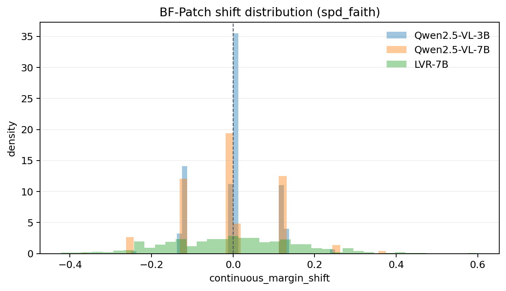
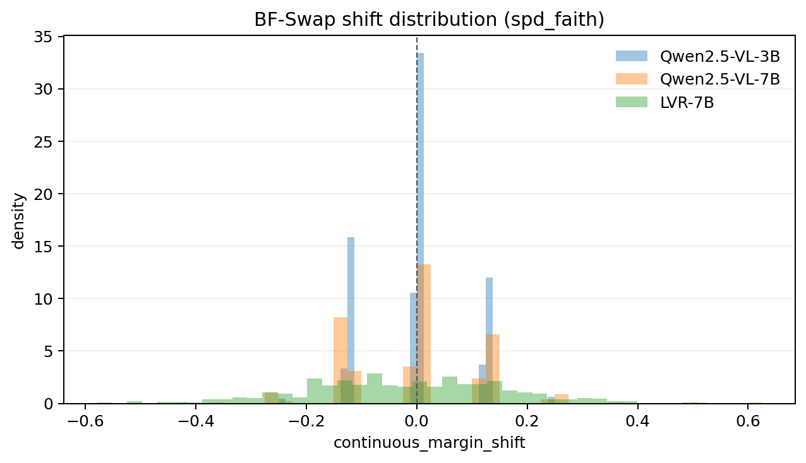
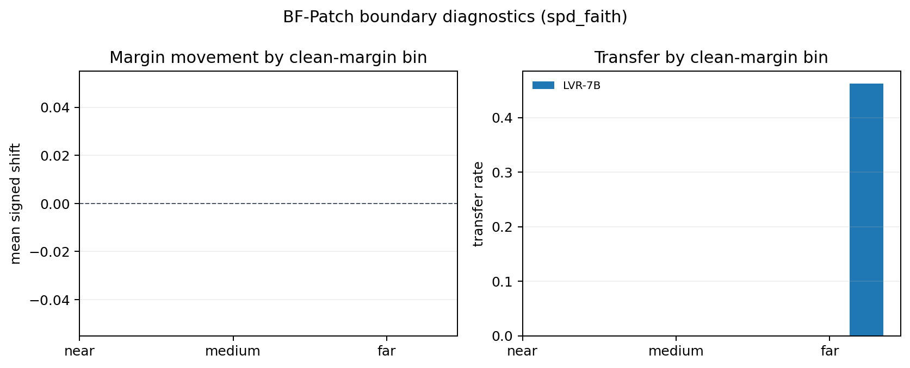
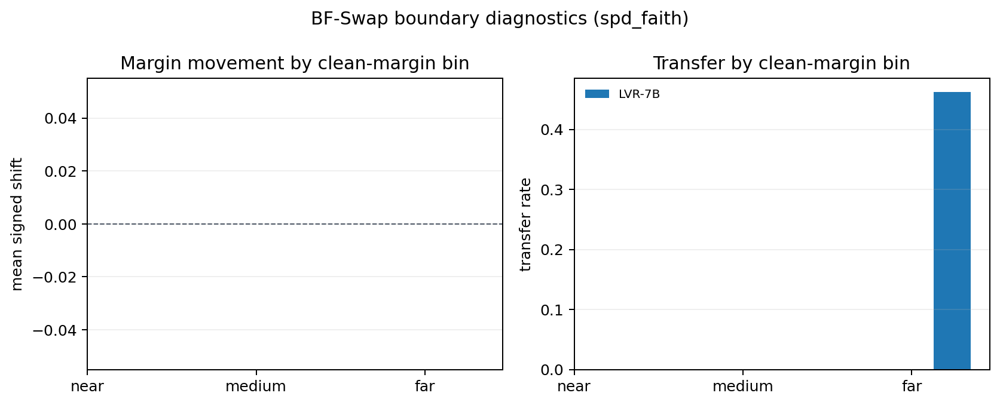
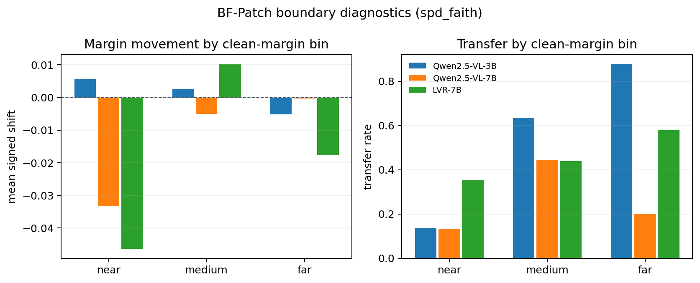
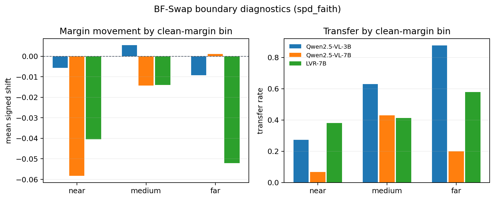
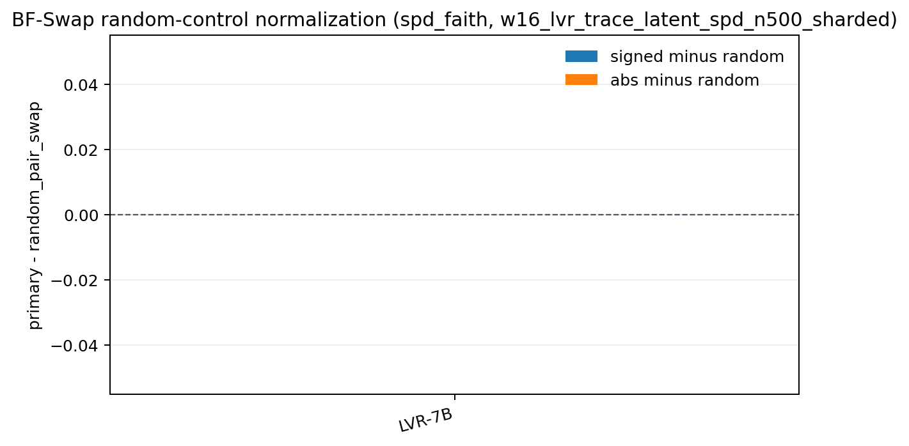
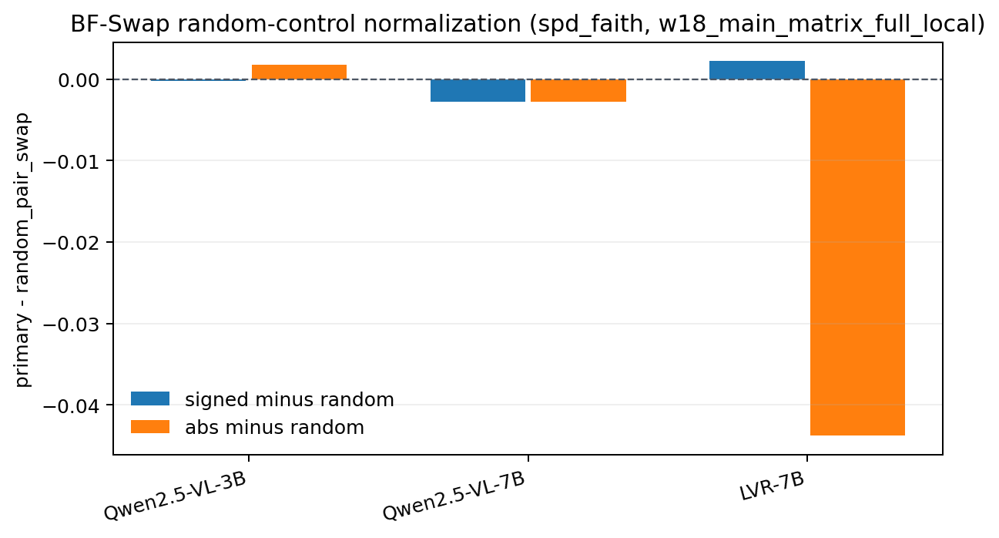

# BF Usage Diagnostics

Generated from saved BF-Patch/BF-Swap artifacts. No model inference is run.

Input roots: `runs/w18_main_matrix_full_local/merged`, `runs/w16_lvr_trace_latent_spd_n500_sharded/merged`

Output directory: `runs/bf_usage_diagnostics_w18_w16`

## Interpretation

This report separates the BF evidence into directional, magnitude, boundary, control, and provenance views. `mean_signed_shift` is the usual directional continuous margin. `mean_abs_shift` measures whether patching moves the margin at all, even if positive and negative effects cancel. `directional_accuracy` is `P(continuous_margin_shift > 0)`. Boundary bins use `abs(clean_margin)`: `near < 0.1`, `medium < 0.5`, `far >= 0.5`.

## Summary

| Run | Task | Metric | Model | Records | Shift n | Coverage | Signed | Abs | Direction | Transfer |
|---|---|---|---|---|---|---|---|---|---|---|
| w16_lvr_trace_latent_spd_n500_sharded | spd_faith | BF-Patch | LVR-7B | 500 | 0 | 0.0% | - | - | - | 46.2% |
| w16_lvr_trace_latent_spd_n500_sharded | spd_faith | BF-Swap | LVR-7B | 500 | 0 | 0.0% | - | - | - | 46.2% |
| w18_main_matrix_full_local | spd_faith | BF-Patch | LVR-7B | 500 | 500 | 100.0% | -0.0047 | 0.1275 | 48.2% | 43.0% |
| w18_main_matrix_full_local | spd_faith | BF-Patch | Qwen2.5-VL-3B | 500 | 500 | 100.0% | -0.0025 | 0.0535 | 34.2% | 77.6% |
| w18_main_matrix_full_local | spd_faith | BF-Patch | Qwen2.5-VL-7B | 500 | 500 | 100.0% | -0.0028 | 0.0803 | 36.8% | 27.0% |
| w18_main_matrix_full_local | spd_faith | BF-Swap | LVR-7B | 500 | 500 | 100.0% | -0.0229 | 0.1427 | 44.6% | 41.8% |
| w18_main_matrix_full_local | spd_faith | BF-Swap | Qwen2.5-VL-3B | 500 | 500 | 100.0% | -0.0050 | 0.0580 | 33.4% | 78.0% |
| w18_main_matrix_full_local | spd_faith | BF-Swap | Qwen2.5-VL-7B | 500 | 500 | 100.0% | -0.0052 | 0.0833 | 35.4% | 26.4% |

## Boundary Bins

| Run | Task | Metric | Model | Bin | Records | Shift n | Signed | Abs | Direction | Transfer |
|---|---|---|---|---|---|---|---|---|---|---|
| w16_lvr_trace_latent_spd_n500_sharded | spd_faith | BF-Patch | LVR-7B | far | 500 | 0 | - | - | - | 46.2% |
| w16_lvr_trace_latent_spd_n500_sharded | spd_faith | BF-Patch | LVR-7B | medium | 0 | 0 | - | - | - | - |
| w16_lvr_trace_latent_spd_n500_sharded | spd_faith | BF-Patch | LVR-7B | near | 0 | 0 | - | - | - | - |
| w16_lvr_trace_latent_spd_n500_sharded | spd_faith | BF-Swap | LVR-7B | far | 500 | 0 | - | - | - | 46.2% |
| w16_lvr_trace_latent_spd_n500_sharded | spd_faith | BF-Swap | LVR-7B | medium | 0 | 0 | - | - | - | - |
| w16_lvr_trace_latent_spd_n500_sharded | spd_faith | BF-Swap | LVR-7B | near | 0 | 0 | - | - | - | - |
| w18_main_matrix_full_local | spd_faith | BF-Patch | LVR-7B | far | 38 | 38 | -0.0177 | 0.1647 | 42.1% | 57.9% |
| w18_main_matrix_full_local | spd_faith | BF-Patch | LVR-7B | medium | 349 | 349 | 0.0102 | 0.1212 | 53.3% | 43.8% |
| w18_main_matrix_full_local | spd_faith | BF-Patch | LVR-7B | near | 113 | 113 | -0.0464 | 0.1347 | 34.5% | 35.4% |
| w18_main_matrix_full_local | spd_faith | BF-Patch | Qwen2.5-VL-3B | far | 338 | 338 | -0.0052 | 0.0570 | 37.0% | 87.6% |
| w18_main_matrix_full_local | spd_faith | BF-Patch | Qwen2.5-VL-3B | medium | 140 | 140 | 0.0027 | 0.0491 | 30.7% | 63.6% |
| w18_main_matrix_full_local | spd_faith | BF-Patch | Qwen2.5-VL-3B | near | 22 | 22 | 0.0057 | 0.0284 | 13.6% | 13.6% |
| w18_main_matrix_full_local | spd_faith | BF-Patch | Qwen2.5-VL-7B | far | 336 | 336 | -0.0004 | 0.0830 | 40.2% | 19.9% |
| w18_main_matrix_full_local | spd_faith | BF-Patch | Qwen2.5-VL-7B | medium | 149 | 149 | -0.0050 | 0.0755 | 31.5% | 44.3% |
| w18_main_matrix_full_local | spd_faith | BF-Patch | Qwen2.5-VL-7B | near | 15 | 15 | -0.0333 | 0.0667 | 13.3% | 13.3% |
| w18_main_matrix_full_local | spd_faith | BF-Swap | LVR-7B | far | 38 | 38 | -0.0521 | 0.1541 | 50.0% | 57.9% |
| w18_main_matrix_full_local | spd_faith | BF-Swap | LVR-7B | medium | 349 | 349 | -0.0140 | 0.1308 | 44.4% | 41.3% |
| w18_main_matrix_full_local | spd_faith | BF-Swap | LVR-7B | near | 113 | 113 | -0.0405 | 0.1757 | 43.4% | 38.1% |
| w18_main_matrix_full_local | spd_faith | BF-Swap | Qwen2.5-VL-3B | far | 338 | 338 | -0.0092 | 0.0573 | 32.8% | 87.6% |
| w18_main_matrix_full_local | spd_faith | BF-Swap | Qwen2.5-VL-3B | medium | 140 | 140 | 0.0054 | 0.0571 | 35.7% | 62.9% |
| w18_main_matrix_full_local | spd_faith | BF-Swap | Qwen2.5-VL-3B | near | 22 | 22 | -0.0057 | 0.0739 | 27.3% | 27.3% |
| w18_main_matrix_full_local | spd_faith | BF-Swap | Qwen2.5-VL-7B | far | 336 | 336 | 0.0011 | 0.0904 | 41.1% | 19.9% |
| w18_main_matrix_full_local | spd_faith | BF-Swap | Qwen2.5-VL-7B | medium | 149 | 149 | -0.0143 | 0.0680 | 25.5% | 43.0% |
| w18_main_matrix_full_local | spd_faith | BF-Swap | Qwen2.5-VL-7B | near | 15 | 15 | -0.0583 | 0.0750 | 6.7% | 6.7% |

## Margin Provenance

| Run | Task | Metric | Model | Source | Records | n shift | Signed | Abs | Transfer |
|---|---|---|---|---|---|---|---|---|---|
| w16_lvr_trace_latent_spd_n500_sharded | spd_faith | BF-Patch | LVR-7B | parsed_answer_fallback_legacy | 500 | 0 | - | - | 46.2% |
| w16_lvr_trace_latent_spd_n500_sharded | spd_faith | BF-Swap | LVR-7B | parsed_answer_fallback_legacy | 500 | 0 | - | - | 46.2% |
| w18_main_matrix_full_local | spd_faith | BF-Patch | LVR-7B | candidate_sequence_logprob_legacy | 500 | 500 | -0.0047 | 0.1275 | 43.0% |
| w18_main_matrix_full_local | spd_faith | BF-Patch | Qwen2.5-VL-3B | candidate_sequence_logprob_legacy | 500 | 500 | -0.0025 | 0.0535 | 77.6% |
| w18_main_matrix_full_local | spd_faith | BF-Patch | Qwen2.5-VL-7B | candidate_sequence_logprob_legacy | 500 | 500 | -0.0028 | 0.0803 | 27.0% |
| w18_main_matrix_full_local | spd_faith | BF-Swap | LVR-7B | candidate_sequence_logprob_legacy | 500 | 500 | -0.0229 | 0.1427 | 41.8% |
| w18_main_matrix_full_local | spd_faith | BF-Swap | Qwen2.5-VL-3B | candidate_sequence_logprob_legacy | 500 | 500 | -0.0050 | 0.0580 | 78.0% |
| w18_main_matrix_full_local | spd_faith | BF-Swap | Qwen2.5-VL-7B | candidate_sequence_logprob_legacy | 500 | 500 | -0.0052 | 0.0833 | 26.4% |

## BF-Swap Control Normalization

`primary - random_pair_swap` is the key source-specificity diagnostic. Positive absolute-shift difference means the paired counterfactual swap moves the margin more than a random latent replacement; near-zero values mean the effect is not specific to the source pair.

| Run | Task | Model | Control | Cells | Signed delta | Abs delta | Abs ratio | Primary transfer | Control transfer |
|---|---|---|---|---|---|---|---|---|---|
| w16_lvr_trace_latent_spd_n500_sharded | spd_faith | LVR-7B | random_pair_swap | 1 | - | - | - | 46.2% | 47.2% |
| w16_lvr_trace_latent_spd_n500_sharded | spd_faith | LVR-7B | reverse_swap | 1 | - | - | - | 46.2% | 50.2% |
| w16_lvr_trace_latent_spd_n500_sharded | spd_faith | LVR-7B | self_swap | 1 | - | - | - | 46.2% | 53.0% |
| w18_main_matrix_full_local | spd_faith | LVR-7B | random_pair_swap | 1 | 0.0022 | -0.0438 | 0.7651 | 41.8% | 44.2% |
| w18_main_matrix_full_local | spd_faith | LVR-7B | reverse_swap | 1 | 0.0085 | -0.0030 | 0.9791 | 41.8% | 52.8% |
| w18_main_matrix_full_local | spd_faith | LVR-7B | self_swap | 1 | -0.0229 | 0.1427 | - | 41.8% | 0.0% |
| w18_main_matrix_full_local | spd_faith | Qwen2.5-VL-3B | random_pair_swap | 1 | -0.0002 | 0.0018 | 1.0311 | 78.0% | 77.8% |
| w18_main_matrix_full_local | spd_faith | Qwen2.5-VL-3B | reverse_swap | 1 | -0.0087 | 0.0002 | 1.0043 | 78.0% | 16.2% |
| w18_main_matrix_full_local | spd_faith | Qwen2.5-VL-3B | self_swap | 1 | -0.0050 | 0.0580 | - | 78.0% | 0.0% |
| w18_main_matrix_full_local | spd_faith | Qwen2.5-VL-7B | random_pair_swap | 1 | -0.0027 | -0.0027 | 0.9680 | 26.4% | 26.8% |
| w18_main_matrix_full_local | spd_faith | Qwen2.5-VL-7B | reverse_swap | 1 | 0.0022 | 0.0017 | 1.0215 | 26.4% | 67.2% |
| w18_main_matrix_full_local | spd_faith | Qwen2.5-VL-7B | self_swap | 1 | -0.0052 | 0.0833 | - | 26.4% | 0.0% |

## Figures

