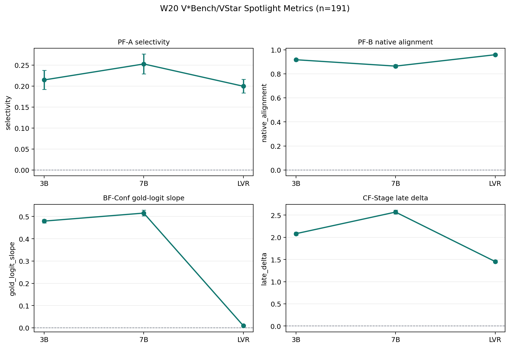
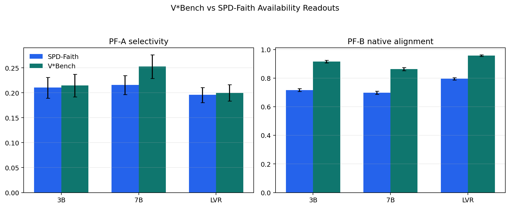

# W20 V*Bench/VStar Spotlight Results

Generated from real local artifacts on 2026-05-26.

Run root: `runs/w20_spotlight_vstar_n191_final`

Merged artifacts: `runs/w20_spotlight_vstar_n191_final/merged`

## Data Staging

V*Bench is prepared from the full Hugging Face repository snapshot, not from
`datasets.load_dataset("craigwu/vstar_bench")`. The parquet/Data Studio view
drops the per-image JSON files that contain bbox annotations; the repository
snapshot contains `direct_attributes/sa_XXXXX.json` and
`relative_position/sa_XXXXX.json`, which this run reads directly.

| Field | Value |
|---|---|
| n_seen | 191 |
| n_written | 191 |
| direct_attributes | 115 |
| relative_position | 76 |
| n_missing_bbox | 0 |
| n_skipped_no_image | 0 |
| bbox_area_ratio median | 0.000770 |
| bbox_area_ratio min/max | 0.000019 / 0.014356 |

The bbox median area is below 0.1% of image pixels, so this is genuinely a
small-region high-resolution localization stress test. The main PF-A/PF-B
spotlight uses the 1024px audit image budget. BF-Conf uses a metric-specific
512px budget to avoid high-resolution logit-lens OOM on 24GB GPUs; PF-A/PF-B
are unaffected by that lower-resolution auxiliary readout.

## Validation

```text
tools/validate_main_matrix.py runs/w20_spotlight_vstar_n191_final --tasks vstar --min-samples 150 --bf-min-pairs 0
MAIN MATRIX VALIDATION PASSED rows=12 ci_rows=51

merged sanity overall_status=pass total_reports=12 failed_reports=0
```

## Primary Results

| Metric | Qwen2.5-VL-3B | Qwen2.5-VL-7B | LVR-7B |
|---|---|---|---|
| PF-A selectivity | 0.2146 [0.1921, 0.2373] | 0.2527 [0.2291, 0.2763] | 0.1996 [0.1837, 0.2164] |
| PF-B native alignment | 0.9169 [0.9070, 0.9263] | 0.8639 [0.8522, 0.8755] | 0.9585 [0.9526, 0.9638] |
| BF-Conf gold-logit slope | 0.4794 [0.4716, 0.4871] | 0.5153 [0.5024, 0.5289] | 0.0091 [0.0082, 0.0101] |
| CF-Stage late delta | 2.0817 [2.0482, 2.1166] | 2.5689 [2.5262, 2.6141] | 1.4533 [1.4269, 1.4824] |



## V*Bench vs SPD-Faith Availability



The preregistered spotlight hypothesis only partially holds. LVR-7B has the
highest PF-B native alignment on V*Bench (`0.9585 [0.9526, 0.9638]`), above both
Qwen baselines. However, PF-A corruption selectivity is highest for Qwen2.5-VL-7B
(`0.2527 [0.2291, 0.2763]`) and lower for LVR-7B (`0.1996 [0.1837, 0.2164]`).
This means V*Bench supports the narrower claim that LVR representations are
strongly aligned with native visual-region signals on a high-resolution bbox
task, but it does not support the stronger claim that LVR uniquely dominates
region-corruption selectivity.

## Reproduction

```bash
./venv/bin/python tools/prepare_vstar_local.py \
  --out data/vstar \
  --cache-dir hf_cache_vstar \
  --copy-images \
  --min-image-side 1024 \
  --expected-min-samples 180

PYTHON_BIN=./venv/bin/python MPLCONFIGDIR=/tmp/matplotlib-lvr-eval HF_HUB_OFFLINE=1 HF_DATASETS_OFFLINE=1 \
  bash tools/run_and_hold.sh 0,1,2,3 bash tools/launch_main_matrix.sh \
  --configs config.main_vstar_n191.yaml \
  --models qwen2_5_vl_3b,qwen2_5_vl_7b,lvr_7b \
  --metrics all \
  --gpus 0,1,2,3 \
  --run-root runs/w20_spotlight_vstar_n191

# BF-Conf/PF-B rerun after BF-Conf 512px low-memory fix:
PYTHON_BIN=./venv/bin/python MPLCONFIGDIR=/tmp/matplotlib-lvr-eval HF_HUB_OFFLINE=1 HF_DATASETS_OFFLINE=1 \
  bash tools/run_and_hold.sh 0,1,2,3 bash tools/launch_main_matrix.sh \
  --configs config.main_vstar_n191.yaml \
  --models qwen2_5_vl_3b,qwen2_5_vl_7b,lvr_7b \
  --metrics bf_conf_calibrated_progression,pf_b_patch_alignment \
  --gpus 0,1,2,3 \
  --run-root runs/w20_spotlight_vstar_n191_rerun_bfconf_pfb

./venv/bin/python tools/summarize_vstar_results.py
```
